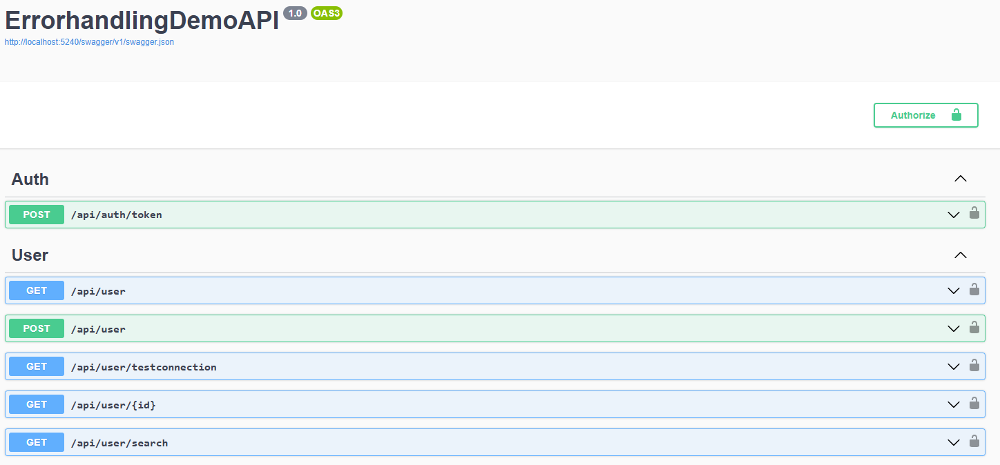
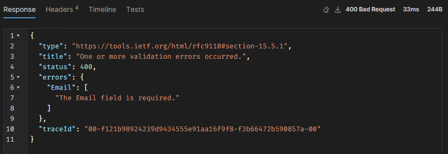
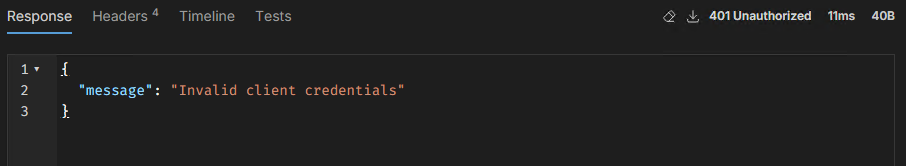
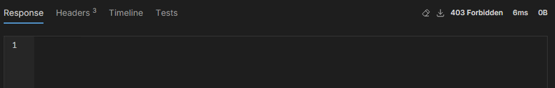
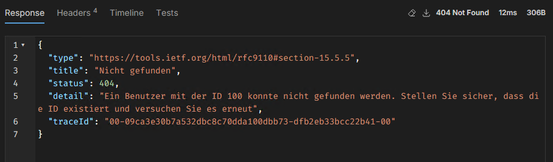
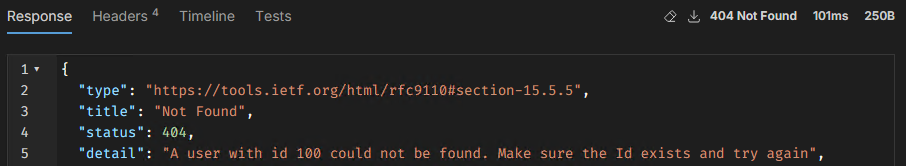
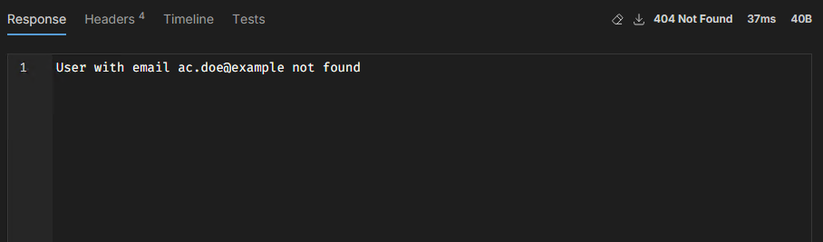
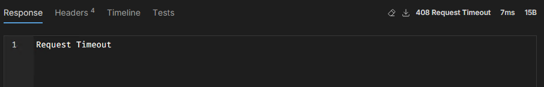
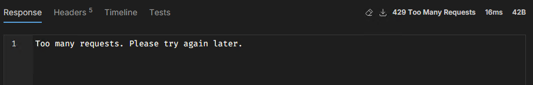

# HandlingErrorsGracefully

> Well, sort of

- [HandlingErrorsGracefully](#handlingerrorsgracefully)
  - [Intro](#intro)
  - [What's in the repo?](#whats-in-the-repo)
  - [DemoAPI](#demoapi)
    - [Scenarios](#scenarios)
    - [Swagger](#swagger)
    - [Postman collection](#postman-collection)
  - [Running the project](#running-the-project)
    - [Authentication](#authentication)
    - [Error responses](#error-responses)
      - [400 BadRequest](#400-badrequest)
        - [Code](#code)
        - [Response Windows PowerShell](#response-windows-powershell)
        - [Response Windows PowerShell](#response-windows-powershell-1)
      - [401 UnAuthorized](#401-unauthorized)
      - [403 Forbidden](#403-forbidden)
      - [404 NotFound](#404-notfound)
        - [With message detail in either 'English' or 'German'](#with-message-detail-in-either-english-or-german)
          - [Code](#code-1)
          - [Response Windows PowerShell](#response-windows-powershell-2)
          - [Response PowerShell](#response-powershell)
        - [With message as a simple string](#with-message-as-a-simple-string)
          - [Code](#code-2)
          - [Response Windows PowerShell](#response-windows-powershell-3)
          - [Response PowerShell](#response-powershell-1)
      - [408 RequestTimeout](#408-requesttimeout)
      - [429 TooManyRequests](#429-toomanyrequests)
  - [Error handling - best practices](#error-handling---best-practices)
    - [Avoid nested try/catch](#avoid-nested-trycatch)
    - [Let your functions just generate exceptions](#let-your-functions-just-generate-exceptions)
    - [Try/Catch on the highest possible level](#trycatch-on-the-highest-possible-level)
      - [Now, where should you place a `try/catch` block?](#now-where-should-you-place-a-trycatch-block)
      - [What about re-throwing exceptions?](#what-about-re-throwing-exceptions)
    - [PowerShell vs Windows PowerShell error handling](#powershell-vs-windows-powershell-error-handling)
      - [Code](#code-3)
      - [Response PowerShell](#response-powershell-2)
      - [Dealing with empty `ErrorDetails`](#dealing-with-empty-errordetails)
        - [Windows PowerShell __only__](#windows-powershell-only)
      - [Don't fallback to returning the generic .NET message](#dont-fallback-to-returning-the-generic-net-message)
    - [Key take-away](#key-take-away)

## Intro

This repository contains all the materials for an error handling and debugging session.

## What's in the repo?

- Source code for the 'DemoAPI' in the `DemoAPISourceCode` folder.
- Postman collection with all API calls and examples in the `DemoAPI` folder.
- PowerShell Code examples to demonstrate different error handling and debugging scenarios.

## DemoAPI

The DemoAPI returns multiple error responses, allowing you to test and familiarize yourself with how different errors in PowerShell can be resolved in various scenarios. Below is a table listing common error scenarios and the appropriate solutions. By practicing with these scenarios, you will become a true error handling and debugging ninja.

### Scenarios

| Error Type / scenario   | Description                                                       | Possible Solution                                                           | Method/API Call         | Header Control                       |
| ----------------------- | ----------------------------------------------------------------- | --------------------------------------------------------------------------- | ----------------------- | ------------------------------------ |
| `400 Bad Request`       | The request is missing required parameters or has invalid values. | Ensure all required parameters are provided and correctly formatted.        | `POST /api/users`       | -                                    |
| `401 Unauthorized`      | Authentication failed due to invalid credentials.                 | Verify the provided credentials (ClientId/ClientSecret).                    | `POST /api/token`       | -                                    |
| `403 Forbidden`         | The user does not have permission to access the resource.         | Ensure the user has the correct roles or permissions.                       | `GET /api/roles`        | `ForceForbidden` (set to true)       |
| `408 Request Timeout`   | The request took too long and timed out.                          | Retry the request using retry logic (retry count set in headers).           | `POST /api/users`       | `RetryCount` header                  |
| `429 Too Many Reqeusts` | Too many requests have been made in a short period.               | Wait for a while and try again later.                                       | `GET /api/users`        | `SimulateRateLimiting` (set to true) |
| `404 Not Found`         | Errors will be returned in the language specified.                | Check the `Accept-Language` header and adjust for the desired language.     | `GET /api/users/{id}`   | `Accept-Language` header             |
| `404 Not Found`         | Errors will be returned as a string instead of an JSON.           | Requires different error handling contrary to the previous `404 Not Found`. | `GET /api/users/search` | -                                    |

> [!NOTE]
> **Languages**:<br> Depending on the `Accept-Language` header (e.g., `en` for English or `de` for German), error messages will be returned in the requested language. The API defaults to `de`. This only applies to the `api/user<id>` endpoint.

### Swagger

The API comes with a swagger interface located at: `{url}/swagger/index.html`



### Postman collection

A Postman collection is available. See: https://github.com/JeroenBL/HandlingErrorsGracefully/blob/main/Errorhandling.postman_collection.json

## Running the project

1. Donwload the latest release from: https://github.com/JeroenBL/HandlingErrorsGracefully/releases
2. Extract the contents of the zip file.
3. click on: `run.cmd` to start the API.

>[!NOTE]
> By default; the API runs on URL: http://localhost:5240/swagger/index.html<br>
>
> If you wish to change the URL and port, update the `config.json` in the project folder accordingly.

You can also add this variable to the Postman collection (on the collection itself) by adding a _

### Authentication

A token is required on order to make authenticated calls to the API. To retrieve a token, you will to make an API call to: `api/auth/token`. A body is need with both a `ClientId` and `ClientSecret`. Both are _hardcoded_ set to: `demo`.

```powershell
$splatGetTokenParams = @{
    Uri = 'http://localhost:5240/api/auth/token'
    Method = 'POST'
    Body = @{
        ClientId = 'demo'
        ClientSecret = 'demo'
    } | ConvertTo-Json
    ContentType = 'application/json'
}
Invoke-RestMethod @splatGetTokenParams
```

### Error responses

#### 400 BadRequest


##### Code

```powershell
$demoBlock = {
    $baseUrl = 'http://localhost:5240'
    $splatGetTokenParams = @{
        Uri = "$baseUrl/api/auth/token"
        Method = 'POST'
        Body = @{
            ClientId = 'demo'
            ClientSecret = 'demo'
        } | ConvertTo-Json
        ContentType = 'application/json'
    }
    $responseToken = Invoke-RestMethod @splatGetTokenParams
    $headers = @{
        Authorization = "Bearer $($responseToken.token)"
        'Accept-Language' = 'en'
    }

    try {
        $body = @{
            firstName = 'Simon'
            lastName = 'Doe'
            description = 'created by PowerShell'
        } | ConvertTo-Json
        Invoke-RestMethod -Uri "$baseUrl/api/user" -Method 'POST' -Body $body -Headers $headers -ContentType 'application/json'
    } catch {
        Write-Host ""
        Write-Host -Fore Cyan "Exception information"
        Write-Host -Fore Cyan "----------------------------------------------------"
        Write-Host -Fore Yellow "PowerShell version : $($PSVersionTable.PSVersion)"
        Write-Host -Fore Red "Exception of type  : $($_.Exception.GetType())"
        Write-Host -Fore Red "Exception message  : $($_.Exception.Message)"
        Write-Host -Fore Red "ErrorDetails       : $($_.ErrorDetails.Message)"
        if (!$IsCoreCLR) {
            Write-Host -Fore Red "ResponseStream     : $([System.IO.StreamReader]::new($_.Exception.Response.GetResponseStream()).ReadToEnd())"
        }
        Write-Host -Fore Cyan "----------------------------------------------------"
        Write-Host ""
    }
}.ToString()

pwsh -command $demoBlock
powershell -command $demoBlock
```

##### Response Windows PowerShell
```
Exception information
----------------------------------------------------
PowerShell version : 5.1.22621.4391
Exception of type  : System.Net.WebException
Exception message  : The remote server returned an error: (400) Bad Request.
ErrorDetails       :
ResponseStream     : {"type":"https://tools.ietf.org/html/rfc9110#section-15.5.1","title":"One or more validation errors occurred.","status":400,"errors":{"Email":["The Email field is required."]},"traceId":"00-9e5b895c4b294221cf58063fb2454ed7-fdd3781289f8aa07-00"}
----------------------------------------------------
```

##### Response Windows PowerShell
```
Exception information
----------------------------------------------------
PowerShell version : 7.5.0
Exception of type  : Microsoft.PowerShell.Commands.HttpResponseException
Exception message  : Response status code does not indicate success: 400 (Bad Request).
ErrorDetails       : {"type":"https://tools.ietf.org/html/rfc9110#section-15.5.1","title":"One or more validation errors occurred.","status":400,"errors":{"Email":["The Email field is required."]},"traceId":"00-ea3d224a2fb9bcae09e99697468727b1-e802870f65cd791e-00"}
----------------------------------------------------
```

#### 401 UnAuthorized


#### 403 Forbidden


#### 404 NotFound

Depending on the API call and request headers, a `404` will be thrown in different variations.

##### With message detail in either 'English' or 'German'





###### Code

```powershell
$demoBlock = {
    $baseUrl = 'http://localhost:5240'
    $splatGetTokenParams = @{
        Uri = "$baseUrl/api/auth/token"
        Method = 'POST'
        Body = @{
            ClientId = 'demo'
            ClientSecret = 'demo'
        } | ConvertTo-Json
        ContentType = 'application/json'
    }
    $responseToken = Invoke-RestMethod @splatGetTokenParams
    $headers = @{
        Authorization = "Bearer $($responseToken.token)"
        'Accept-Language' = 'en'
    }

    try {
        Invoke-RestMethod -Uri "$baseUrl/api/user/100" -Method 'GET' -Headers $headers
    } catch {
        Write-Host ""
        Write-Host -Fore Cyan "Exception information"
        Write-Host -Fore Cyan "----------------------------------------------------"
        Write-Host -Fore Yellow "PowerShell version : $($PSVersionTable.PSVersion)"
        Write-Host -Fore Red "Exception of type  : $($_.Exception.GetType())"
        Write-Host -Fore Red "Exception message  : $($_.Exception.Message)"
        Write-Host -Fore Red "ErrorDetails       : $($_.ErrorDetails.Message)"
        if (!$IsCoreCLR) {
            Write-Host -Fore Red "ResponseStream     : $([System.IO.StreamReader]::new($_.Exception.Response.GetResponseStream()).ReadToEnd())"
        }
        Write-Host -Fore Cyan "----------------------------------------------------"
        Write-Host ""
    }
}.ToString()

pwsh -command $demoBlock
powershell -command $demoBlock
```
###### Response Windows PowerShell

```
Exception information
----------------------------------------------------
PowerShell version : 5.1.22621.4391
Exception of type  : System.Net.WebException
Exception message  : The remote server returned an error: (404) Not Found.
ErrorDetails       :
ResponseStream     : {"type":"https://tools.ietf.org/html/rfc9110#section-15.5.5","title":"Not Found","status":404,"detail":"A user with id 100 could not be found. Make sure the Id exists and try again","traceId":"00-1f0e9cad9effb8f3d3cf5832c5ab46e4-7ee7136993250153-00"}
----------------------------------------------------
```

###### Response PowerShell

```
Exception information
----------------------------------------------------
PowerShell version : 7.5.0
Exception of type  : Microsoft.PowerShell.Commands.HttpResponseException
Exception message  : Response status code does not indicate success: 404 (Not Found).
ErrorDetails       : {"type":"https://tools.ietf.org/html/rfc9110#section-15.5.5","title":"Not Found","status":404,"detail":"A user with id 100 could not be found. Make sure the Id exists and try again","traceId":"00-108aa897827b9bbf734cc85dd63c0e37-1f7b8be4d36bc3ea-00"}
----------------------------------------------------
```

##### With message as a simple string



###### Code

```powershell
$demoBlock = {
    $baseUrl = 'http://localhost:5240'
    $splatGetTokenParams = @{
        Uri = "$baseUrl/api/auth/token"
        Method = 'POST'
        Body = @{
            ClientId = 'demo'
            ClientSecret = 'demo'
        } | ConvertTo-Json
        ContentType = 'application/json'
    }
    $responseToken = Invoke-RestMethod @splatGetTokenParams
    $headers = @{
        Authorization = "Bearer $($responseToken.token)"
        'Accept-Language' = 'en'
    }

    try {
        Invoke-RestMethod -Uri "$baseUrl/api/user/search?email=ac.doe@example" -Method 'GET' -Headers $headers
    } catch {
        Write-Host ""
        Write-Host -Fore Cyan "Exception information"
        Write-Host -Fore Cyan "----------------------------------------------------"
        Write-Host -Fore Yellow "PowerShell version : $($PSVersionTable.PSVersion)"
        Write-Host -Fore Red "Exception of type  : $($_.Exception.GetType())"
        Write-Host -Fore Red "Exception message  : $($_.Exception.Message)"
        Write-Host -Fore Red "ErrorDetails       : $($_.ErrorDetails.Message)"
        if (!$IsCoreCLR) {
            Write-Host -Fore Red "ResponseStream     : $([System.IO.StreamReader]::new($_.Exception.Response.GetResponseStream()).ReadToEnd())"
        }
        Write-Host -Fore Cyan "----------------------------------------------------"
        Write-Host ""
    }
}.ToString()

pwsh -command $demoBlock
powershell -command $demoBlock
```
###### Response Windows PowerShell

```
Exception information
----------------------------------------------------
PowerShell version : 5.1.22621.4391
Exception of type  : System.Net.WebException
Exception message  : The remote server returned an error: (404) Not Found.
ErrorDetails       :
ResponseStream     : User with email ac.doe@example not found
----------------------------------------------------
```

###### Response PowerShell

```
Exception information
----------------------------------------------------
PowerShell version : 7.5.0
Exception of type  : Microsoft.PowerShell.Commands.HttpResponseException
Exception message  : Response status code does not indicate success: 404 (Not Found).
ErrorDetails       : User with email ac.doe@example not found
----------------------------------------------------
```

#### 408 RequestTimeout

Only happens with a `POST` call to: `/api/user` and if the `SimulateFailure` and `RetryCount` options are added to the request headers.



```powershell
function Invoke-RestMethodWithRetry {
    param (
        [Parameter(Mandatory = $true)]
        [hashtable]$Params,
        [int]$MaxRetries,
        [int]$RetryDelay
    )

    $retryCount = 0

    while ($retryCount -lt $MaxRetries) {
        try {
            return Invoke-RestMethod @Params
        } catch {
            if ($_.Exception.StatusCode -eq 408) {
                $retryCount++
                if ($retryCount -lt $MaxRetries) {
                    Write-Host "Request timed out. Retrying... ($retryCount/$MaxRetries)"
                    Start-Sleep -Seconds $RetryDelay
                } else {
                    Write-Host 'Max retries reached. Failing...'
                    throw
                }
            } else {
                throw
            }
        }
    }
}

$baseUrl = 'http://localhost:5240'
$splatGetTokenParams = @{
    Uri = "$baseUrl/api/auth/token"
    Method = 'POST'
    Body = @{
        ClientId = 'demo'
        ClientSecret = 'demo'
    } | ConvertTo-Json
    ContentType = 'application/json'
}
$responseToken = Invoke-RestMethod @splatGetTokenParams

$headers = @{
    Authorization = "Bearer $($responseToken.token)"
    'Accept-Language' = 'en'
    'RetriesBeforeSuccess' = 2
}

$splatParams = @{
    Uri = "$BaseUrl/api/user"
    Method = 'POST'
    Body = @{
        firstName   = 'Tom'
        lastName    = 'Doe'
        email       = 'TDoe@example'
        description = 'Created by PowerShell'
    } | ConvertTo-Json
    Headers = $headers
    ContentType = 'application/json'
}
Invoke-RestMethodWithRetry -Params $splatParams -MaxRetries 3 -RetryDelay 1
```

#### 429 TooManyRequests



Only happens when retrieving all users by calling: `/api/user` and if the `SimulateRateLimiting` option is added to the request header.

> [!NOTE]
> This needs requires different error handling on Windows PowerShell vs PowerShell because of the response headers.

```powershell
$baseUrl = 'http://localhost:5240'
$splatGetTokenParams = @{
    Uri = "$baseUrl/api/auth/token"
    Method = 'POST'
    Body = @{
        ClientId = 'demo'
        ClientSecret = 'demo'
    } | ConvertTo-Json
    ContentType = 'application/json'
}
$responseToken = Invoke-RestMethod @splatGetTokenParams
$headers = @{
    Authorization = "Bearer $($responseToken.token)"
    'Accept-Language' = 'en'
    'SimulateRateLimiting' = $true
}

$pageSize = 10
$pageNumber = 1
$totalUsersFetched = 0
$allUsers = [System.Collections.Generic.List[object]]::new()
$totalUsers = 0

do {
    try {
        $splatParams = @{
            Uri     = "$($baseUrl)/api/user?pageNumber=$pageNumber&pageSize=$pageSize"
            Method  = 'GET'
            Headers = $headers
        }

        $response = Invoke-RestMethod @splatParams
        $users = $response.Users

        $totalUsers = $response.totalUsers
        $totalUsersFetched += $users.Count
        $allUsers.AddRange($users)
        $pageNumber++
    } catch {
       if ($_.Exception.Response.StatusCode -eq 429) {
            $retryAfter = $_.Exception.Response.Headers.RetryAfter.Delta.Seconds
            if ($retryAfter) {
                Start-Sleep -Seconds $retryAfter
            }

            # Windows PowerShell
            # $retryAfter = $_.Exception.Response.Headers['Retry-After']
            # if ($retryAfter) {
            #     Start-Sleep -Seconds $retryAfter
            # }
        } else {
            throw
        }
    }
} while ($totalUsersFetched -lt $totalUsers)
```

## Error handling - best practices

### Avoid nested try/catch

Structure `try/catch` blocks efficiently. A common mistake is nesting try/catch blocks unnecessarily, like this:

```powershell
try {
    try {
    } catch {

    }
} catch {

}
```

- **Unnecessary Complexity**<br>
  Nesting try/catch blocks like this adds confusion without real benefits.
- **Redundant Error Handling**<br>
  If an inner exception is caught and not re-thrown, the outer catch may never trigger, making it redundant.
- **Harder Debugging**<br>
  It becomes unclear where errors are actually being handled.

>[!NOTE]
Only use nested try/catch blocks if they are necessary for controlling flow, such as when you need to handle a specific error while allowing the script to continue executing.

### Let your functions just generate exceptions

It's perfectly fine to let functions generate exceptions without wrapping code in try/catch blocks. Instead of handling every possible error inside a function, let exceptions bubble up and handle them in your main try/catch block.

```powershell
$script:headers

#region functions
function New-ExampleUser {
    [CmdletBinding()]
    param (
        $UserAccount
    )

    $splatParams = @{
        Uri = "$($actionContext.Configuration.BaseUrl)/api/user"
        Method = 'POST'
        Body = $UserAccount | ConvertTo-Json
        ContentType = 'application/json'
        Headers = $script:headers
    }
    Invoke-RestMethod @splatParams
}
#endregion

try {
    $userAccount = @{
        firstName = 'Simon'
        lastName = 'Doe'
        description = 'created by PowerShell'
    }
    $null = New-ExampleUser -UserAccount $userAccount
} catch {
    $ex = $PSItem
    Write-Warning "Error at Line '$($ex.InvocationInfo.ScriptLineNumber)': $($ex.InvocationInfo.Line). Error: $($ex.Exception.Message)"
}
```

### Try/Catch on the highest possible level

In the example below, we’ve defined two functions: `New-ExampleUser` and `Invoke-ExampleRestMethod`. The latter is a helper function called by `New-ExampleUser`.

```powershell
$script:headers

#region functions
function New-ExampleUser {
    [CmdletBinding()]
    param (
        $UserAccount
    )

    $splatParams = @{
        Uri = "$($actionContext.Configuration.BaseUrl)/api/user"
        Method = 'POST'
        Body = $UserAccount | ConvertTo-Json
        ContentType = 'application/json'
    }
    Invoke-ExampleRestMethod @splatParams
}

function Invoke-ExampleRestMethod {
    [CmdletBinding()]
    param (
        $Uri,
        $Method,
        $Body,
        $ContentType
    )

    $splatParams = @{
        Uri = $Uri
        Method = $Method
        Body = $Body
        ContentType = $ContentType
        headers = @{
        Authorization = "Bearer $($responseToken.token)"
            'Accept-Language' = 'en'
        }
    }
    Invoke-RestMethod @splatParams
}
#endregion

try {
    $userAccount = @{
        firstName = 'Simon'
        lastName = 'Doe'
        description = 'created by PowerShell'
    }
    $null = New-ExampleUser -UserAccount $userAccount
} catch {
    $ex = $PSItem
    Write-Warning "Error at Line '$($ex.InvocationInfo.ScriptLineNumber)': $($ex.InvocationInfo.Line). Error: $($ex.Exception.Message)"
}
```

#### Now, where should you place a `try/catch` block?

A general rule of thumb is to place it at the **highest possible level**. Lower-level functions don’t have context about their caller.

In this example, if `Invoke-ExampleRestMethod` is called, it has no knowledge of who called it. Therefore, if an exception occurs, it cannot determine whether the application should stop or continue — that decision should be made at a higher level. Therefore, its a common best practice to **always** handle errors at the highest possible level.

#### What about re-throwing exceptions?

Lower-level functions **can catch and re-throw** exceptions using `throw` or `throw $_` or `$PSCmdlet.ThrowTerminatingError`.

But be careful:

- ✅ **Re-throwing** is useful if you want to **add context** or **log** the error before letting it bubble up.
- ❌ **Swallowing** exceptions silently or making decisions too deep in the stack can lead to **unexpected behavior** or **lost context**.
- ⚠️ If you re-throw using `throw $_`, it **preserves the original error**. Using just `throw` inside a `catch` block also does this. Avoid `throw $e` because that creates a new exception causing you to **lose the original exception and stack trace**.

### PowerShell vs Windows PowerShell error handling

By default, if an API returns an error, you can expect the error to be in `$_.ErrorDetails.Message`. As demonstrated in the code below with a _404-NotFound_ error.

#### Code

```powershell
$demoBlock = {
    $baseUrl = 'http://localhost:5240'
    $splatGetTokenParams = @{
        Uri = "$baseUrl/api/auth/token"
        Method = 'POST'
        Body = @{
            ClientId = 'demo'
            ClientSecret = 'demo'
        } | ConvertTo-Json
        ContentType = 'application/json'
    }
    $responseToken = Invoke-RestMethod @splatGetTokenParams
    $headers = @{
        Authorization = "Bearer $($responseToken.token)"
        'Accept-Language' = 'en'
    }

    try {
        Invoke-RestMethod -Uri "$baseUrl/api/user/search?email=ac.doe@example" -Method 'GET' -Headers $headers
    } catch {
        Write-Host ""
        Write-Host -Fore Cyan "Exception information"
        Write-Host -Fore Cyan "----------------------------------------------------"
        Write-Host -Fore Red "Exception message    : $($_.Exception.Message)"
        Write-Host -Fore Red "ErrorDetails.Message : $($_.ErrorDetails.Message)"
        Write-Host -Fore Cyan "----------------------------------------------------"
        Write-Host ""
    }
}.ToString()

pwsh -command $demoBlock
```

#### Response PowerShell

If we take a look at the _exception information_ below, we can see that; `ErrorDetails.Message` contains the error message thrown by the API: _User with email ac.doe@example not found_.

```
Exception information
----------------------------------------------------
Exception message    : Response status code does not indicate success: 404 (Not Found).
ErrorDetails.Message : User with email ac.doe@example not found
----------------------------------------------------
```

In some situations, the `ErrorDetails.Message` object may be empty. In such cases, we are left with only the generic error message thrown by .NET.

```
Exception information
----------------------------------------------------
Exception message    : Response status code does not indicate success: 404 (Not Found).
ErrorDetails.Message : 
----------------------------------------------------
```

> [!NOTE]
> While this _generic_ message may be sufficient in some scenarios (such as a 404-NotFound, where the generic .NET message provides enough information), when dealing with a _400 Bad Request_, it is crucial to obtain the exact messages thrown by the API because they are far more descriptive and helpful in diagnosing the issue.

#### Dealing with empty `ErrorDetails` 

If the `ErrorDetails` object is empty, we must fall back to retrieving the error response from the API using the following command: 

```powershell
$([System.IO.StreamReader]::new($_.Exception.Response.GetResponseStream()).ReadToEnd())
``` 

##### Windows PowerShell __only__

However, while the .NET object `[System.IO.StreamReader]` __is available__ in __all__ PowerShell versions, the function `GetResponseStream()` is __only__ available in _Windows PowerShell_. That is because this function is directly to tied to the type of exception being thrown. In the case of _Windows PowerShell_ the exception type is __always__ a `System.Net.WebException`.

> [!NOTE]
> An empty `ErrorDetails.Message` is caused by a known _bug_ in Windows PowerShell. However, not all APIs are affected by this bug. Therefore, it’s important to __always test__ how the specific API behaves and whether its impacted. __If the API is not affected, the fall back to `[StreamReader]` will not work.__

> [!WARNING]
> Not all APIs are affected by the bug. In such cases, the `[StreamReader]` fall back will __not__ work.

#### Don't fallback to returning the generic .NET message

### Key take-away

Don't fall back to returning the _generic_ .NET message unless there's absolutely no other option.  Generic messages can lead to confusion and poor diagnostics.

|                                  | `ErrorDetails.Message`                     | Fall back                                                          | Last resort                      |
| -------------------------------- | ------------------------------------------ | ------------------------------------------------------------------ | -------------------------------- |
| Windows PowerShell (on-premises) | Might be empty                             | If `ErrorDetails.Message` is empty, fall back to: `[StreamReader]` | Fall back to `Exception.Message` |
| PowerShell Core (cloud)          | Always contains error message from the API | -                                                                  | -                                |

- ✅ Always prefer using detailed error messages returned by the API.
- ⚠️ An empty `ErrorDetails.Message` may is caused by a _bug_ in Windows PowerShell.
- 🔍 Not all APIs are affected by this bug — thoroughly test to determine behavior.
- ❌ The `[StreamReader]` fallback will __not work__ if the API is __not affected__ by the bug.
- 🚫 Don't fall back to the _generic_ .NET message unless there's no other option.
- 🧩 Generic messages can cause confusion and complicate diagnostics.
- 📝 As a last resort, log that no detailed error information is available.
