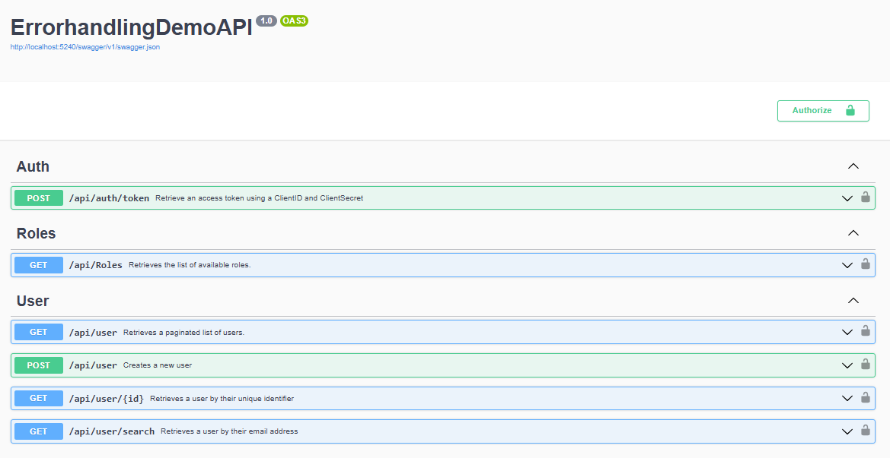

# HandlingErrorsGracefully

- [HandlingErrorsGracefully](#handlingerrorsgracefully)
  - [Intro](#intro)
  - [What's in the repo?](#whats-in-the-repo)
  - [DemoAPI](#demoapi)
    - [Swagger](#swagger)
  - [Running the project](#running-the-project)
    - [Authentication](#authentication)
    - [Postman collection](#postman-collection)

## Intro

## What's in the repo?

- Source code for the 'DemoAPI' in the `DemoAPISourceCode` folder.
- Postman collection with all API calls and examples in the `DemoAPI` folder.
- PowerShell Code examples to demonstrate different error handling and debugging scenarios.

## DemoAPI

The DemoAPI is merely an example to demonstrate different error handling responses and how PowerShell deals with them.

### Swagger

The API comes with a swagger interface located at: `{url}/swagger/index.html`



## Running the project

1. Donwload the latest release from: https://github.com/JeroenBL/HandlingErrorsGracefully/releases
2. Extract the contents of the zip file.
3. click on: `run.cmd` to start the API.

>[!NOTE]
> By default; the API runs on URL: http://localhost:5240/swagger/index.html<br>
>
> If you wish to change the URL and port, update the `config.json` in the project folder accordingly.

### Authentication

A token is required on order to make authenticated calls to the API. To retrieve a token, you will to make an API call to: `api/auth/token`. A body is need with both a `ClientId` and `ClientSecret`. Both are _hardcoded_ set to: `demo`.

```powershell
$splatGetTokenParams = @{
    Uri = 'http://localhost:5240/api/auth/token'
    Method = 'POST'
    Body = @{
        ClientId = 'demo'
        ClientSecret = 'demo'
    } | ConvertTo-Json
    ContentType = 'application/json'
}
Invoke-RestMethod @splatGetTokenParams
```

### Postman collection

A Postman collection is available. See: https://github.com/JeroenBL/HandlingErrorsGracefully/blob/main/DemoAPI/Errorhandling.postman_collection.json